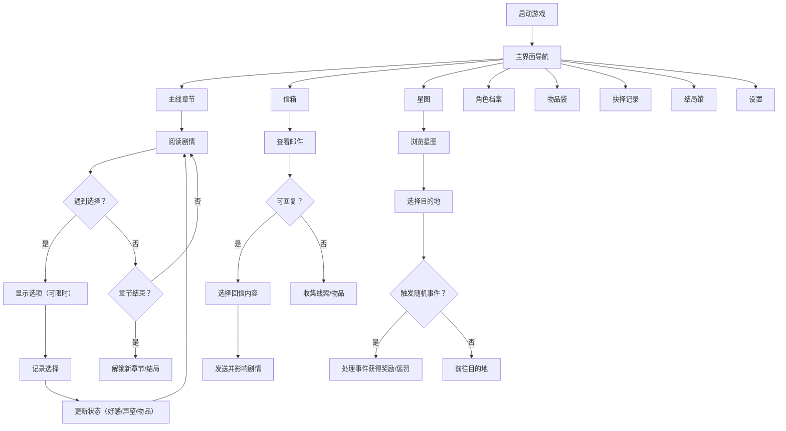

## 1. 产品概述

《群星邮差》是一款移动端文字冒险游戏，玩家扮演星际信使，穿梭于多个星球之间，通过选择路线和回信来影响各个星球的命运。游戏融合了叙事选择、收集养成、探索解谜等多种玩法，为玩家打造沉浸式的太空信使体验。

- 核心目标：为移动用户提供高质量的文字冒险叙事体验，通过丰富的选择分支和多结局设计增强玩家的代入感和重玩价值
- 目标用户：喜欢叙事游戏、科幻题材、文字冒险的18-35岁移动端玩家
- 市场价值：填补高品质移动端太空题材文字冒险游戏的市场空白，强调离线游玩和沉浸式体验

## 2. 核心特性

### 2.1 用户角色
| 角色 | 注册方式 | 核心权限 |
|------|---------|---------|
| 星际信使（玩家） | 无需注册，本地存档 | 游玩全部内容、收集成就、解锁结局 |

### 2.2 功能模块
1. **主线章节**：章节选择、剧情推进、分支对话、限时选择、章节回放
2. **信箱**：收件箱、发件箱、隐藏信件、线索收集、回信系统
3. **星图**：星系导航、星球信息、路线选择、随机事件触发
4. **角色档案**：角色列表、好感度、角色背景、关系状态
5. **物品袋**：物品收集、物品详情、物品组合、线索整理
6. **抉择记录**：选择历史、关键选择标记、分支回溯查看
7. **结局馆**：结局收集、结局解锁进度、结局回顾播放
8. **设置**：文字速度调整、背景音乐开关、音效开关、无剧透提示、自动存档开关、存档管理

### 2.3 页面详情
| 页面名称 | 模块名称 | 功能描述 |
|---------|---------|---------|
| 主线章节 | 章节列表 | 显示已解锁章节，锁定章节状态显示 |
| 主线章节 | 剧情阅读 | 逐字显示文字、角色立绘、背景图、文字速度可调 |
| 主线章节 | 选项系统 | 分支选项、限时倒计时、关键选择高亮标记 |
| 信箱 | 邮件列表 | 按分类（主线/支线/隐藏）显示邮件，未读标记 |
| 信箱 | 回信系统 | 多选项回信，影响剧情走向和角色关系 |
| 星图 | 星系视图 | 3D/2D风格星图，星球节点、航线连接 |
| 星图 | 星球详情 | 星球背景、当前状态、可接任务、声望显示 |
| 角色档案 | 角色列表 | 头像、姓名、身份、好感度进度条 |
| 角色档案 | 角色详情 | 背景故事、解锁片段、关系变化记录 |
| 物品袋 | 物品网格 | 已收集物品显示、分类筛选、稀有度标识 |
| 物品袋 | 物品组合 | 拖拽/选择两个物品尝试合成或触发线索 |
| 抉择记录 | 时间线 | 按章节显示所有选择节点，关键节点特殊标记 |
| 抉择记录 | 分支对比 | 显示选择带来的影响和后续变化 |
| 结局馆 | 结局墙 | 已解锁结局缩略图、未解锁剪影、进度统计 |
| 结局馆 | 结局回顾 | 重新播放结局CG和文字 |
| 设置 | 偏好设置 | 文字速度、音乐开关、音效、无剧透提示 |
| 设置 | 存档管理 | 手动存档/读档、自动存档列表、存档删除 |

## 3. 核心流程

玩家启动游戏后进入主界面，从主线章节开始推进剧情。在阅读过程中会遇到选择节点，玩家的选择会影响角色好感度、阵营声望、物品获得等。信箱中会收到来自各星球的信件，玩家可以选择回复方式。星图用于选择下一个目的地，可能触发随机事件。收集的物品可以在物品袋中查看和组合。抉择记录可回溯历史选择，结局馆展示已解锁的多个结局。

## 4. 用户界面设计

### 4.1 设计风格
- **主色调**：深空蓝 `#0a1628` 作为主背景，星尘紫 `#5b4b8a` 作为主色，暖金 `#d4a84b` 作为强调色
- **辅助色**：星云粉 `#c77dff`、科技青 `#4cc9f0`、警告红 `#ef476f`
- **按钮风格**：圆角胶囊形按钮，带微妙光晕效果，按下有深度反馈
- **字体选择**：标题使用具有科幻感的衬线字体（如 'Cinzel' 或 'Noto Serif SC'），正文使用清晰易读的无衬线字体（'Noto Sans SC'）
- **布局风格**：卡片式布局，半透明玻璃质感（backdrop-filter: blur），移动端底部Tab导航
- **图标风格**：线性风格图标，配合发光效果，使用 lucide-react 图标库
- **动效设计**：星空粒子背景、文字逐字淡入、选项悬浮发光、页面切换滑入动画

### 4.2 页面设计概述
| 页面名称 | 模块名称 | UI元素 |
|---------|---------|---------|
| 主线章节 | 章节列表 | 深空背景、章节卡片（发光边框）、进度条、锁定图标 |
| 主线章节 | 剧情阅读 | 半透明对话面板、角色立绘（左右浮动）、背景星球图、继续按钮 |
| 主线章节 | 选项系统 | 圆角按钮选项、限时倒计时进度条、关键选项金色光晕 |
| 信箱 | 邮件列表 | 分类标签页、邮件条目（未读小红点）、发件人头像 |
| 信箱 | 回信系统 | 信件内容卡片、多选项回复按钮、发送确认动效 |
| 星图 | 星系视图 | 黑色星空背景+粒子、星球节点（发光圆点）、曲线航线 |
| 星图 | 星球详情 | 底部弹出面板、星球大图、属性标签 |
| 角色档案 | 角色列表 | 网格布局、角色卡片、好感度渐变进度条 |
| 物品袋 | 物品网格 | 稀有度颜色边框、物品图标、数量标记 |
| 物品袋 | 物品组合 | 两个物品槽位、合成按钮、结果弹窗 |
| 抉择记录 | 时间线 | 垂直时间线、节点圆点、关键节点金色 |
| 结局馆 | 结局墙 | 瀑布流/网格布局、已解锁彩色、未解锁灰色剪影 |
| 设置 | 偏好设置 | 开关控件、滑块（文字速度）、分段控件 |

### 4.3 响应式
- 移动优先设计，针对 375px-430px 宽度优化
- 最大宽度限制 480px，居中显示，两侧星空背景填充
- 触控目标最小 44x44px，适合手指点击
- 底部导航栏高度 64px，适配安全区域

### 4.4 视觉特效
- **环境氛围**：全屏星空粒子动画背景，缓慢漂浮的星辰
- **转场动画**：页面切换使用淡入+轻微缩放效果
- **文字效果**：剧情文字逐字显示，光标闪烁
- **交互反馈**：按钮按下缩放、选项悬浮光晕、获得物品闪光动效
