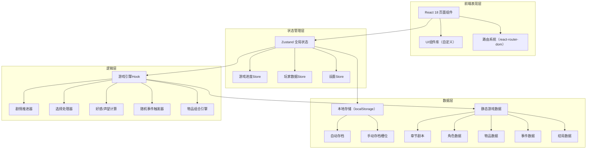

## 1. 架构设计



## 2. 技术描述

- **前端框架**：React 18 + TypeScript 5
- **构建工具**：Vite 5
- **样式方案**：Tailwind CSS 3 + 自定义CSS变量
- **路由管理**：react-router-dom 6
- **状态管理**：Zustand 4
- **图标库**：lucide-react
- **数据持久化**：localStorage（自动存档/手动存档）
- **后端**：无（纯前端游戏，全部数据本地存储）
- **初始化工具**：vite-init（react-ts模板）

## 3. 路由定义

| 路由 | 页面名称 | 用途 |
|------|---------|------|
| / | 游戏首页/主菜单 | 游戏入口，显示主菜单和快速存档 |
| /chapters | 主线章节 | 章节列表和选择 |
| /chapters/:id | 章节剧情 | 具体章节的剧情阅读和选择 |
| /mailbox | 信箱 | 查看和回复邮件 |
| /starmap | 星图 | 星系导航和星球选择 |
| /characters | 角色档案 | 角色列表和详情 |
| /characters/:id | 角色详情 | 单个角色的详细信息 |
| /inventory | 物品袋 | 物品查看和组合 |
| /choices | 抉择记录 | 历史选择时间线 |
| /endings | 结局馆 | 结局收集和回顾 |
| /settings | 设置 | 游戏偏好和存档管理 |

## 4. 数据模型

### 4.1 核心数据类型

```typescript
// 玩家存档数据
interface PlayerSave {
  id: string;
  timestamp: number;
  chapterProgress: Record<string, ChapterProgress>;
  currentChapterId: string | null;
  currentSceneId: string | null;
  characterRelations: Record<string, CharacterRelation>;
  factionReputation: Record<string, number>;
  inventory: InventoryItem[];
  clues: string[];
  unlockedEndings: string[];
  achievements: string[];
  choices: PlayerChoice[];
  mails: Mail[];
  playTime: number;
  settings: GameSettings;
}

// 章节进度
interface ChapterProgress {
  chapterId: string;
  unlocked: boolean;
  completed: boolean;
  currentSceneId: string;
  visitedScenes: string[];
}

// 角色关系
interface CharacterRelation {
  characterId: string;
  affection: number; // 0-100
  trust: number; // 0-100
  status: 'stranger' | 'acquaintance' | 'friend' | 'ally' | 'lover' | 'enemy';
  unlockedSegments: string[];
}

// 物品
interface InventoryItem {
  itemId: string;
  quantity: number;
  obtainedAt: number;
  fromChoice?: string;
}

// 玩家选择记录
interface PlayerChoice {
  id: string;
  chapterId: string;
  sceneId: string;
  choiceId: string;
  choiceText: string;
  timestamp: number;
  isKeyChoice: boolean;
  consequences: string[];
}

// 邮件
interface Mail {
  id: string;
  from: string;
  subject: string;
  content: string;
  type: 'main' | 'side' | 'hidden';
  read: boolean;
  replied: boolean;
  replyOptions?: ReplyOption[];
  selectedReply?: string;
  timestamp: number;
}

// 游戏设置
interface GameSettings {
  textSpeed: number; // 1-5
  bgmEnabled: boolean;
  sfxEnabled: boolean;
  spoilerFree: boolean;
  autoSave: boolean;
}
```

### 4.2 游戏静态数据模型

```typescript
// 章节
interface Chapter {
  id: string;
  title: string;
  subtitle: string;
  order: number;
  coverImage: string;
  description: string;
  unlockedByDefault: boolean;
  unlockCondition?: UnlockCondition;
  scenes: Scene[];
}

// 场景（剧情节点）
interface Scene {
  id: string;
  chapterId: string;
  background: string;
  characterOnStage?: CharacterOnStage[];
  dialogues: Dialogue[];
  nextScene?: string;
  choices?: Choice[];
  timedChoice?: TimedChoice;
  effects?: SceneEffect[];
  triggers?: Trigger[];
}

// 对话
interface Dialogue {
  id: string;
  speakerId?: string; // null表示旁白
  speakerName?: string; // 自定义名称
  text: string;
  emotion?: 'neutral' | 'happy' | 'sad' | 'angry' | 'surprised' | 'mysterious';
  textEffect?: 'normal' | 'shake' | 'glitch' | 'fade';
}

// 选项
interface Choice {
  id: string;
  text: string;
  isKeyChoice: boolean;
  condition?: ChoiceCondition;
  nextSceneId: string;
  effects: ChoiceEffect[];
}

// 限时选择
interface TimedChoice {
  timeLimit: number; // 秒
  choices: Choice[];
  defaultChoiceId: string;
}

// 物品定义
interface Item {
  id: string;
  name: string;
  description: string;
  icon: string;
  rarity: 'common' | 'rare' | 'epic' | 'legendary';
  category: 'item' | 'clue' | 'letter' | 'key';
  combinable: boolean;
  combineRecipes?: CombineRecipe[];
}

// 物品合成配方
interface CombineRecipe {
  ingredients: string[]; // item ids
  result: string; // result item id or event id
  resultType: 'item' | 'clue' | 'event';
  description: string;
}

// 角色定义
interface Character {
  id: string;
  name: string;
  title: string;
  avatar: string;
  portrait: string;
  faction: string;
  description: string;
  backgroundStory: string[];
  personalityTags: string[];
}

// 结局
interface Ending {
  id: string;
  title: string;
  description: string;
  type: 'good' | 'neutral' | 'bad' | 'hidden' | 'true';
  thumbnail: string;
  cgImage: string;
  storyText: string;
  unlockConditions: UnlockCondition[];
}

// 随机事件
interface RandomEvent {
  id: string;
  title: string;
  description: string;
  probability: number;
  triggerLocation: string[];
  choices: Choice[];
}

// 成就
interface Achievement {
  id: string;
  name: string;
  description: string;
  icon: string;
  hidden: boolean;
  condition: AchievementCondition;
}
```

## 5. 项目目录结构

```
src/
├── components/          # 可复用组件
│   ├── layout/         # 布局组件（导航、底栏等）
│   ├── game/           # 游戏专用组件（对话框、选项、角色立绘等）
│   └── ui/             # 通用UI组件（卡片、按钮、进度条等）
├── pages/              # 页面组件
│   ├── Home.tsx
│   ├── Chapters.tsx
│   ├── ChapterPlay.tsx
│   ├── Mailbox.tsx
│   ├── StarMap.tsx
│   ├── Characters.tsx
│   ├── CharacterDetail.tsx
│   ├── Inventory.tsx
│   ├── ChoicesRecord.tsx
│   ├── EndingsGallery.tsx
│   └── Settings.tsx
├── store/              # Zustand状态管理
│   ├── gameStore.ts    # 游戏进度、玩家数据
│   └── settingsStore.ts # 设置相关
├── data/               # 游戏静态数据
│   ├── chapters.ts     # 章节剧本
│   ├── characters.ts   # 角色数据
│   ├── items.ts        # 物品数据
│   ├── events.ts       # 随机事件
│   ├── endings.ts      # 结局数据
│   └── achievements.ts # 成就数据
├── hooks/              # 自定义Hooks
│   ├── useGameEngine.ts # 游戏核心引擎
│   ├── useSaveLoad.ts  # 存档读写
│   └── useTypewriter.ts # 打字机效果
├── utils/              # 工具函数
│   ├── storage.ts      # localStorage封装
│   ├── conditions.ts   # 条件判断器
│   └── effects.ts      # 效果处理器
├── types/              # TypeScript类型定义
│   └── index.ts
├── App.tsx
├── main.tsx
└── index.css
```

## 6. 核心功能实现要点

### 6.1 剧情推进引擎
- 使用栈结构管理当前场景状态
- 支持按对话ID逐句推进
- 选项选择后计算效果并跳转到对应场景
- 自动存档触发点：章节结束、关键选择后

### 6.2 条件判断系统
- 支持检查：好感度阈值、声望值、物品持有、选择历史、结局解锁
- 条件表达式支持AND/OR组合
- 用于：选项显示条件、章节解锁条件、结局触发条件

### 6.3 效果处理系统
- 选择效果类型：好感变化、声望变化、获得物品、解锁线索、触发邮件、解锁场景、解锁结局
- 效果立即生效并持久化
- 获得物品/成就时显示通知弹窗

### 6.4 物品组合系统
- 选择两个物品尝试合成
- 匹配预定义配方
- 合成成功：获得新物品/线索/触发事件
- 合成失败：提示信息

### 6.5 存档系统
- 自动存档：关键节点自动保存到 localStorage
- 手动存档：3个存档槽位
- 存档包含：全部玩家状态、当前进度、设置
- 支持导出/导入存档（JSON格式）
